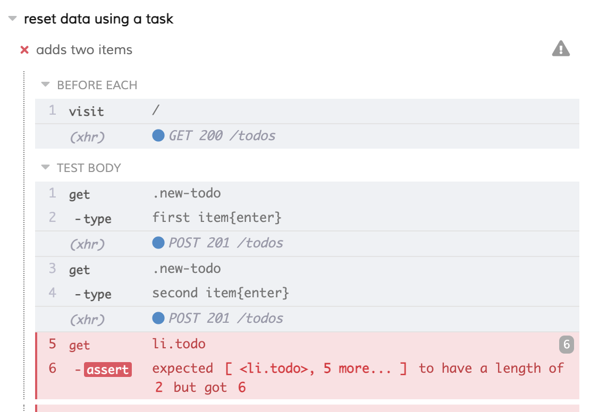
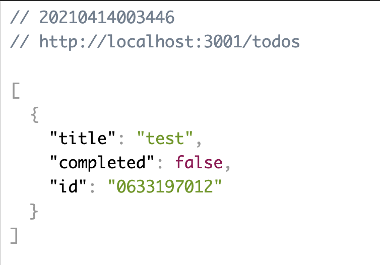

## ☀️ Part 4: Reset state data

### 📚 You will learn

- how one test can affect another test by leaving its data behind
- when and how to reset state during testing

+++

- keep `todomvc` app running
- open `cypress/integration/04-reset-state/spec.js`
- some tests start to fail 😕

+++



+++

```javascript
beforeEach(() => {
  cy.visit('/')
})
const addItem = text => {
  cy.get('.new-todo').type(`${text}{enter}`)
}
it('adds two items', () => {
  addItem('first item')
  addItem('second item')
  cy.get('li.todo').should('have.length', 2)
})
```

+++

## Questions

- how to reset the database?
  - go to `todomvc/package.json`
  - try to reset it from command line
  - **tip**: we are also using [json-server-reset](https://github.com/bahmutov/json-server-reset#readme) middleware which exposes a `/reset` endpoint

+++

## View the `/todos` endpoint

- GET request to `localhost:3001/todos`



+++

## Let's do a POST request

Use Postman or something similar

- POST request to `localhost:3001/reset` 
- GET request to `localhost:3001/todos`

+++

## Questions

- how to make an arbitrary cross-domain XHR request from Cypress?
  - **hint**: use `cy.request()`
- reset the database before each test
  - modify `04-reset-state/spec.js` to make XHR call to reset the database
  - before or after `cy.visit`?

Note:
Students should modify `cypress/integration/04-reset-state/spec.js` and make the request to reset the database before each test using `cy.request`.

The answer to this and other TODO assignments are in [cypress/integration/04-reset-state/answer.js](/cypress/integration/04-reset-state/answer.js) file.

+++
## Using cy.writeFile

```
"start": "json-server --static . --watch data.json"
```

If we overwrite `todomvc/data.json` and reload the web app we should see new data

+++
## TODO: use cy.writeFile to reset todos

```js
describe('reset data using cy.writeFile', () => {
  beforeEach(() => {
    const emptyTodos = {
      todos: []
    }
    const str = JSON.stringify(emptyTodos, null, 2) + '\n'

    // TODO write file "todomvc/data.json" with stringified todos object
    cy.visit('/')
  })
  ...
})
```

See [`cy.writeFile`](https://on.cypress.io/writefile)

Make sure you are writing the right file.

Note:
Most common mistake is using file path relative to the spec file, should be relative to the project's root folder.

+++

## Using cy.exec

```
    "reset": "node reset-db.js",
    "reset:db": "npm run reset",
    "reset:database": "npm run reset"
```

See [`cy.exec`](https://on.cypress.io/exec)

+++

## TODO: use cy.exec to reset todos

```js
describe('reset data using cy.exec', () => {
  beforeEach(() => {
    // TODO use cy.exec to call command to reset database
    cy.visit('/')
  })

  it('adds two items', () => {
    addItem('first item')
    addItem('second item')
    cy.get('li.todo').should('have.length', 2)
  })
})
```

+++

## Best practices

- reset state before each test
  - in our [Best practices guide](https://on.cypress.io/best-practices)
  - use [`cy.request`](https://on.cypress.io/request), [`cy.writeFile`](https://on.cypress.io/writeFile), [`cy.exec`](https://on.cypress.io/exec)
  - you can also use [`cy.task`](https://on.cypress.io/task)