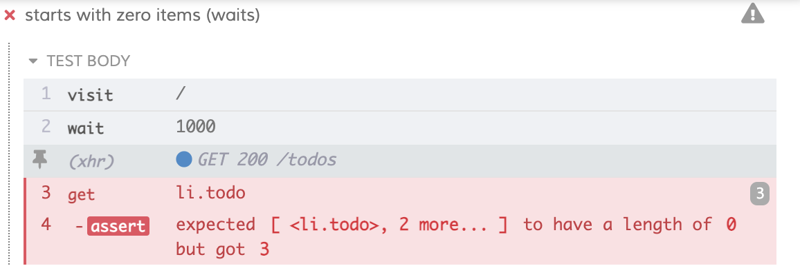

## ☀️ Part 5: Control network calls

### 📚 You will learn

- how to spy / stub network calls
- how to wait for the network calls from tests
- how to use network calls in assertions

+++

- keep `todomvc` app running
- open `cypress/integration/05-xhr/spec.js`
- `cy.route` is deprecated, use `cy.intercept`

+++

## Situation

- there is **no resetting** the state before each test
- the test passes but _something is wrong_

```javascript
it('starts with zero items', () => {
  cy.visit('/')
  cy.get('li.todo').should('have.length', 0)
})
```


+++

## Problem

- page loads
- web application makes XHR call `GET /todos`
  - meanwhile it shows an empty list of todos
- Cypress assertion passes!
- `GET /todos` returns with 2 items
  - they are added to the DOM
  - but the test has already finished

+++

## Waiting

```javascript
it('starts with zero items', () => {
  cy.visit('/')
  cy.wait(1000)
  cy.get('li.todo').should('have.length', 0)
})
```



+++

**better** to wait on a specific XHR request. Network is just observable public effect, just like DOM.

+++

### Todo

In `05-xhr/spec.js` test "starts with zero items"

- spy on specific route with `cy.intercept`
  - should we start mock server _before_ or _after_ `cy.visit`?
- save as an alias
- wait for this XHR alias
  - then check the DOM

**tips:** [`cy.intercept`]('https://on.cypress.io/intercept), [Network requests guide](https://on.cypress.io/network-requests)

+++

💡 No need to `cy.wait(...).then(...)`. All Cypress commands will be chained automatically.

```js
cy.intercept('GET', '/todos').as('todos')
cy.visit('/')
cy.wait('@todos')
// cy.get() will run AFTER cy.wait() finishes
cy.get('li.todo').should('have.length', 0)
```

Read [Introduction to Cypress](https://on.cypress.io/introduction-to-cypress) "Commands Run Serially"

+++

## Todo: Stub network call

Update test "starts with zero items (stubbed response)"

- instead of just spying on XHR call, let's return some mock data
- using cy.intercept does not modify the actual request

```javascript
// returns an empty list
// when `GET /todos` is requested
cy.intercept('GET', '/todos', [])
```

+++

## Todo: Mock request using fixture

```javascript
it('starts with zero items (fixture)', () => {
  // stub `GET /todos` with fixture "empty-list"

  // visit the page
  cy.visit('/')

  // then check the DOM
  cy.get('li.todo').should('have.length', 0)
})
```

**tip:** use [`cy.fixture`](https://on.cypress.io/fixture) command

+++

```javascript
it('loads several items from a fixture', () => {
  // stub route `GET /todos` with data from a fixture file "two-items.json"
  // THEN visit the page
  cy.visit('/')
  // then check the DOM: some items should be marked completed
  // we can do this in a variety of ways
})
```

+++

### Spying on adding an item XHR


Note:
It is important to be able to use DevTools network tab to inspect the XHR and its request and response.

+++

## TODO

- write a test "posts new item to the server" that confirms that new item is posted to the server

```javascript
it('posts new item to the server', () => {
  // spy on "POST /todos", save as alias
  cy.visit('/')
  cy.get('.new-todo').type('test api{enter}')

  // wait on XHR call using the alias, grab its request or response body
  // and make sure it contains
  // {title: 'test api', completed: false}
  // hint: use cy.wait(...).its(...).should('have.contain', ...)
})
```

Note:
see instructions in the `05-xhr/spec.js` for the test

+++

## Testing Loading state

In the application we are showing (very quickly) "Loading" state

```html
<div class="loading" v-show="loading">Loading data ...</div>
```


+++

## TODO

- delay the loading XHR request
- assert the UI is showing "Loading" element
- assert the "Loading" element goes away after XHR completes

⌨️ test "shows loading element"

```javascript
it('shows loading element', () => {
  // delay XHR to "/todos" by a few seconds
  // and respond with an empty list
  // shows Loading element
  // wait for the network call to complete
  // now the Loading element should go away
})
```

+++

## 🏁 Spy and stub the network from your tests

- explore the API calls your app makes
- stub random data to test various scenarios easily

+++

## Let's jump to the next chapter!

- End of Beginner session, Jump to: [13-end](?p=13-end)
- Running our tests on a CI pipeline, Jump to: [06-ci](?p=06-ci)
