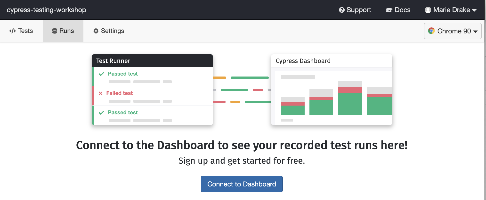
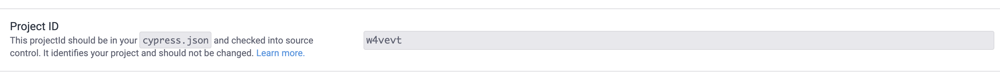
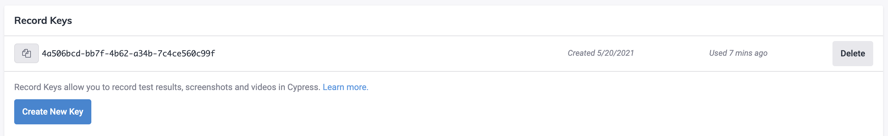

## ☀️ Part 7: The Dashboard

### 📚 You will learn

- Purpose for Cypress Dashboard
- How to send test results to Cypress Dashboard
- Test parallelization using Cypress Dashboard

+++

- CI is nice, but
  - artifacts are all over the place
  - no consistent view of the tests

+++

## Cypress dashboard


+++

- store test results and videos
- insight into each failure
- parallel test execution
- GitHub integration
- analytics (WIP)

+++

## Todo

- create a free account [Cypress Dashboard](https://dashboard.cypress.io/)
- setup a new project in Cypress Dashboard
- extend work in `06-ci` folder
- open Cypress test runner in interactive mode

+++



+++


+++

## Project ID and Record Key





+++

## 

```json
{
  "projectId": "<project ID here>"
}
```

`npx cypress run --record --key <record key here>`

- Tip: use `npx cypress run --help` if in doubt

+++

## Todo: Record your test runs

- record a test run locally (only run the `cypress/integration/06-ci/*.js` tests)
- look at the test results at Cypress dashboard

**tip** [https://on.cypress.io/dashboard-faq](https://on.cypress.io/dashboard-faq)

+++

## Bonus

- pass record key as an environment variable (use `npx cypress run --help` if in doubt 🙂)
- make a test to fail on purpose
- look at the test failure on the dashboard

+++

## Parallelization

- run tests on N machines in 1/N time with [https://on.cypress.io/parallelization](https://on.cypress.io/parallelization)
- requires the `ci-build-id` flag if running locally
- 📺 [Cypress parallelization webinar](https://youtu.be/FfqD1ExUGlw)

```sh
npx cypress run --record --parallel
```

+++


+++

## Let's jump to learning about Cypress reporters

Jump to: [08-reporters](?p=08-reporters)