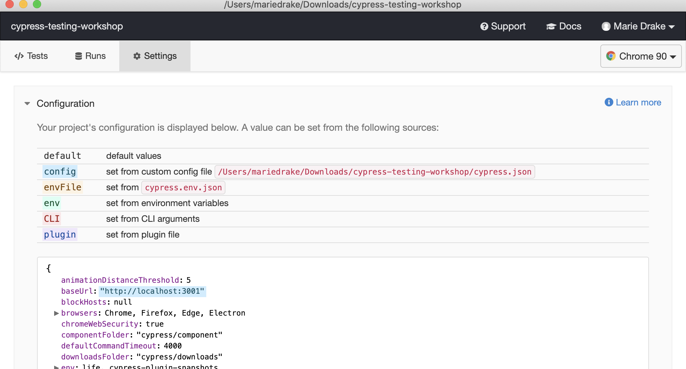

## ☀️ Part 9: Configuration

### 📚 You will learn

- how to control Cypress parameters
- how to pass environment variables to tests

+++

## Configuration settings

- `baseUrl`
- `env`
- `reporter`
- `video`
- and many, many more

+++

Cypress options can be set via:

- `cypress.json`
- command line arguments
- environment variables
- in plugin code
- at run-time

+++

## Question

> Where is the configuration documentation?

Note:
You should find docs at [https://on.cypress.io/configuration](https://on.cypress.io/configuration)

+++

## `cypress.json`

Open `cypress.json` and check which options are set in this project.

```json
{
  "viewportWidth": 400,
  "viewportHeight": 800,
  "ignoreTestFiles": "answer.js",
  "baseUrl": "http://localhost:3000"
}
```

+++

**Tip:** if you have a lot of options to overwrite, use `--config-file <...>` argument to replace `cypress.json`.

+++

## `cypress.json` IntelliSense


You can have IntelliSense in `cypress.json` in a modern editor, like VSCode.

+++

## VSCode

In the user settings, global or workspace set

```json
{
  "json.schemas": [
    {
      "fileMatch": ["cypress.json"],
      "url": "https://on.cypress.io/cypress.schema.json"
    }
  ]
}
```

+++

## VSCode (alternative)

Add `$schema` property to `cypress.json`

```json
{
  "viewportWidth": 600,
  "viewportHeight": 800,
  "ignoreTestFiles": "answer.js",
  "baseUrl": "http://localhost:3000",
  "$schema": "https://on.cypress.io/cypress.schema.json"
}
```

Read: [https://glebbahmutov.com/blog/json-schema-for-the-win/](https://glebbahmutov.com/blog/json-schema-for-the-win/)

+++

## Command line arguments

You can override default and `cypress.json` settings using `--config` flag

```shell
npx cypress open \
  --config baseUrl=http://todomvc.com/examples/dojo/,defaultCommandTimeout=10000
```

+++

## Package scripts

**Warning ⚠️** if you start Cypress via NPM package scripts, use `--` to add CLI arguments.

```json
{
  "scripts": {
    "cy:open": "cypress open",
    "cy:run": "cypress run"
  }
}
```

```shell
npm run cy:run -- --config baseUrl=http://todomvc.com/examples/dojo/
```

+++

## Environment variables

You can override `cypress.json` settings using environment variables that start with `CYPRESS_`

```shell
CYPRESS_baseUrl=http://todomvc.com/examples/dojo/ npx cypress open
# same
CYPRESS_BASE_URL=http://todomvc.com/examples/dojo/ npx cypress open
```

+++

## Environment variables

Use environment variables on CI. Especially to pass the private record key!

```shell
# bad practice, can accidentally show up in STDOUT
npx cypress run --record --recordKey abc...
# good
CYPRESS_RECORD_KEY=abc...
npx cypress run --record
```

+++

## Plugin code

In `cypress/plugins/index.js`

```js
module.exports = (on, config) => {
  config.baseUrl = 'http://todomvc.com/examples/dojo/'
  // change more options ...
  return config
}
```

Docs: [https://on.cypress.io/configuration-api](https://on.cypress.io/configuration-api)

+++

## Run-time configuration

You can change current setting _per spec_ using [Cypress.config](https://on.cypress.io/config) call.

```js
Cypress.config('baseUrl', 'http://todomvc.com/examples/dojo/')
beforeEach(function visitSite() {
  cy.log('Visiting', Cypress.config('baseUrl'))
  cy.visit('/')
})
```

Use at your own risk, because the order of mutations and the final config in each test can be confusing.

+++

## Configuration



+++

## Configuration precedence

`cypress.json` < environment variable < CLI parameter < plugin < run-time

+++

## Todo

Run a single spec in headless mode against:

- `localhost`
- `http://todomvc.com/examples/dojo/`

+++

## Environment variables

Guide [https://on.cypress.io/environment-variables](https://on.cypress.io/environment-variables)

### `cypress.json` "env"

```json
{
  "baseUrl": "http://localhost:3000",
  "env": {
    "todoTitle": "env todo"
  }
}
```

```js
it('has env item', function () {
  expect(Cypress.env('todoTitle')).to.equal('env todo')
})
```

+++

## Environment variables

### `cypress.env.json`

You can create your own cypress.env.json file that Cypress will automatically check.

```json
{
  "eyes": "brown",
  "t-shirt": "large"
}
```

Environment variables will be merged.

+++

## Using env variables

```js
Cypress.env() // returns entire merged object
Cypress.env(name) // returns single value
```

See [https://on.cypress.io/env](https://on.cypress.io/env)

+++

## Environment variables

### command-line arguments

```sh
npx cypress open --env todoTitle="env todo",life=42
```

+++

## Environment variables

### environment variables 🙂

```sh
CYPRESS_todoTitle="env todo" CYPRESS_name=CyBot \
  npx cypress open
```

Unknown `CYPRESS_` variables will be added to `env` object.

+++

## Environment variables

### plugin

```js
module.exports = (on, config) => {
  config.env.fooBar = 'baz'
  return config
}
```

+++

## Environment variables

### run-time

```js
it('has env', () => {
  Cypress.env('life', 1)
  expect(Cypress.env('life')).to.equal(1)
  // change multiple values
  Cypress.env({
    life: 1,
    state: 'busy'
  })
})
```

+++

## Environment variables

🛑 Cannot change env variables at run-time using `Cypress.config('env', ...)`

```js
it('has env', () => {
  expect(Cypress.env('life')).to.equal(42)
  Cypress.config('env', {
    life: 1
  })
  // nope, remains the same
  expect(Cypress.env('life')).to.equal(42)
})
```

✅ Always use `Cypress.env(name, value)` to change.

+++

## Per-environment config

```sh
npx cypress open --config-file qa.json
```

Should load options from `qa.json`.

Question: Will this be merged with other settings from `cypress.json`?

+++

## Per-environment config

[cypress-extends](https://github.com/bahmutov/cypress-extends) is a plugin that adds "extends" support to the configuration file. This allows the config files to remain DRY and avoid duplicating data, but still have multiple files for different scenarios.

cypress.json

```json
{
  "extends": "./base.json",
  "baseUrl": "localhost:3001"
}
```

qa.json

```json
{
  "extends": "./base.json",
  "baseUrl": "https://todomvc.com/examples/react/#/"
}
```

+++

## Summary

- `--config-file <json filepath>` to load different config files
- config (`cypress.json`, command line, env vars, plugin, run-time)
- environment variables (`cypress.json`, command line, env vars, plugin, run-time, `cypress.env.json`)

+++

## Let's jump to learning about Cypress custom commands

Jump to: [10-custom-commands](?p=10-custom-commands)
