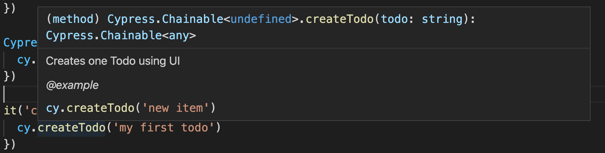

## ☀️ Part 12: Custom commands

### 📚 You will learn

- reusable functions
- adding new custom commands to `cy`
- TypeScript definition for new command
- useful 3rd party commands

+++

- keep `todomvc` app running
- open `cypress/integration/10-custom-commands/spec.js`

+++

### 💯 Code reuse and clarity

```js
beforeEach(function resetData () {
  cy.request('POST', '/reset', {
    todos: []
  })
})
beforeEach(function visitSite () {
  cy.visit('/')
})
```

Before each test we need to reset the server data and visit the page. The data clean up and opening the site could be a lot more complex that our simple example. We probably want to factor out `resetData` and `visitSite` into reusable functions every spec and test can use.

+++

### Todo: move them into `cypress/support/index.js`

Now these `beforeEach` hooks will be loaded _before every_ test in every spec.

Question: Is this a good solution?

+++

### Todo: move them into `cypress/support/hooks.js`

And load from the spec file:

```js
// automatically runs "beforeEach" hooks
import '../../support/hooks'

it('enters 10 todos', function () {
  ...
})
```

A better solution, because only the spec file that needs these hooks can load them.

+++

### Todo: export the `resetData` and `visitSite` as reusable functions

```js
// cypress/support/hooks.js
export function resetData () { ... }
export function visitSite () { ... }
```

⌨️ and update `spec.js` to import these functions beforeEach

```js
beforeEach(() => {
    resetDatabase()
    visitSite()
})
```

+++ 

## Use cases for custom commands

- share code in entire project without individual imports
- complex logic with custom logging into Command Log
  * login sequence
  * many application actions

📝 [on.cypress.io/custom-commands](https://on.cypress.io/custom-commands)

+++

Let's write a custom command to create a todo

```js
// instead of this
cy.get('.new-todo')
  .type('todo 0{enter}')
// use this
cy.createTodo('todo 0')
```

+++

## Todo: write and use "createTodo"

```js
Cypress.Commands.add('createTodo', todo => {
  cy.get('.new-todo').type(`${todo}{enter}`)
})
it('creates a todo', () => {
  cy.createTodo('my first todo')
})
```

+++

## ⬆️ Make it better

- have IntelliSense working for `createTodo`

+++

## Todo: add `createTodo` to `cy` object

How: [https://github.com/cypress-io/cypress-example-todomvc#cypress-intellisense](https://github.com/cypress-io/cypress-example-todomvc#cypress-intellisense)

+++

⌨️ in file `cypress/integration/10-custom-commands/custom-commands.d.ts`

```ts
/// <reference types="cypress" />
declare namespace Cypress {
  interface Chainable<Subject> {
    /**
     * Creates one Todo using UI
     * @example
     * cy.createTodo('new item')
     */
    createTodo(todo: string): Chainable<any>
  }
}
```

+++

Load the new definition file in `cypress/integration/10-custom-commands/spec.js`

```js
/// <reference path="./custom-commands.d.ts" />
```

+++



Note:
Editors other than VSCode might require work.

+++

⚠️ tell Cypress to ignore ".d.ts" files using `ignoreTestFiles` in cypress.json or save ".d.ts" files outside the integration folder. Otherwise Cypress will try load ".d.ts" file as spec and without TypeScript loader it will fail.

+++

## 3rd party custom commands

- [cypress-xpath](https://github.com/cypress-io/cypress-xpath)
- [cypress-axe](https://github.com/component-driven/cypress-axe)
- [cypress-audit](https://github.com/mfrachet/cypress-audit)

[on.cypress.io/plugins#custom-commands](https://on.cypress.io/plugins#custom-commands)

+++

## Try `cypress-xpath`

```sh
# already done in this repo
npm install -D cypress-xpath
```

in `cypress/support/index.js`

```js
require('cypress-xpath')
```

+++

With `cypress-xpath`

```js
it('finds list items', () => {
  cy.xpath('//ul[@class="todo-list"]//li')
    .should('have.length', 3)
})
```

+++

## Best practices

- Making reusable function is often faster than writing a custom command
- Know Cypress API to avoid writing what's already available

+++
## Let's jump to learning about Cypress fixtures

Jump to: [11-fixtures](?p=11-fixtures)