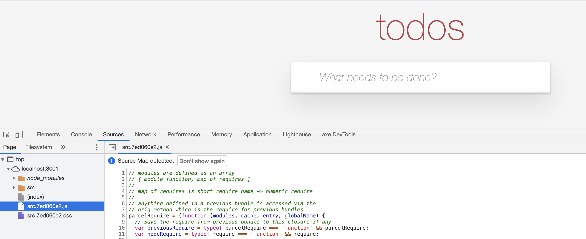
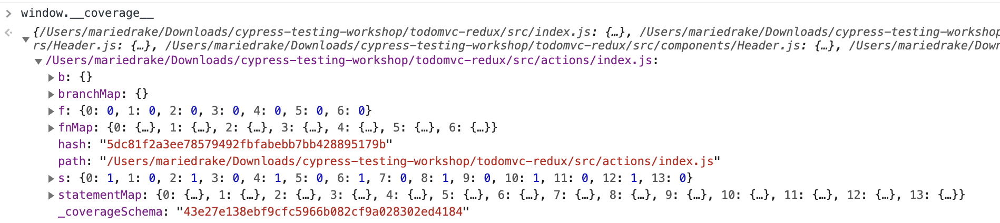
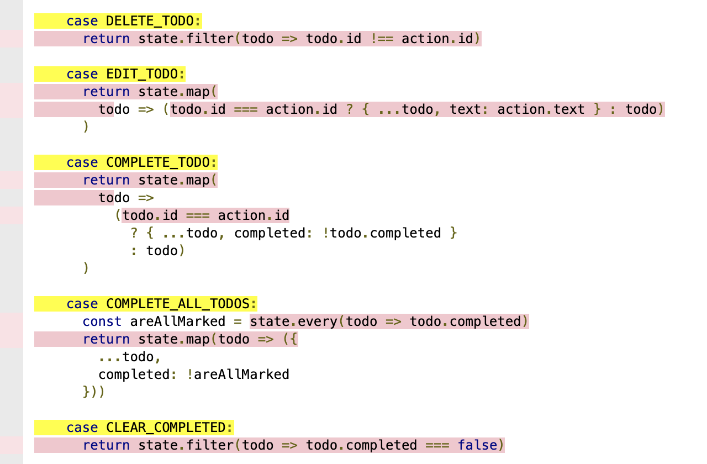

## ☀️ Part 12: Code Coverage

### 📚 You will learn

- how to collect code coverage information
- how to write e2e tests effectively using code coverage as your guide

+++

## ⚠️ use `todomvc-redux` application

- stop TodoMVC
- in one terminal go into `todomvc-redux` and run `npm i` followed by `npm start`

Note:
This will start application and instrument the code on the fly

+++

Open `localhost:3001` and observe instrumented code (the `.js` bundle). The original code can be seen via source maps.

+++



+++

## Instrumenting using babel

babel-plugin-istanbul

```json
{
  "presets": ["@babel/preset-react"],
  "plugins": ["transform-class-properties", "istanbul"]
}
```

+++

## Instrumenting using babel

Be careful when using Jest! Jest already has Istanbul built in.

```json
{
    "presets": ["next/babel"],
    "env": {
      "development": {
        "plugins": ["@emotion"]
      },
      "e2e": {
        "plugins": [
          "@emotion",
          "istanbul"
        ]
      }
    }
}
```

Before running cypress tests, make sure to export `BABEL_ENV` and set to `e2e` on this example.

+++

The code coverage object keeping track of all code lines hit is in the `window.__coverage__` object.

Note:
Explain its structure



+++ 

## Cypress Code Coverage plugin

We are going to use [@cypress/code-coverage] plugin to manage and save this `window.__coverage__` object and generate coverage reports.

+++

## Todo

- enable `@cypress/code-coverage` lines in `cypress/support/index.js` file
- enable `@cypress/code-coverage` lines in `cypress/plugins/index.js` file

+++

## Todo

- start Cypress with `npm run cy:open`
- execute test `cypress/integration/12-code-coverage/spec.js`
- open generated `coverage/lcov-report/index.html` in your browser

+++

Drill down into individual files, for example todos reducer



+++

## Todo 1/3

- see code coverage summary from the terminal with

```shell
npx nyc report --reporter=text
npx nyc report --reporter=text-summary
```

+++

## Todo 2/3

- see code coverage HTML report

```shell
open coverage/lcov-report/index.html
```

+++

## Todo 3/3

- add tests to cover more source lines

**Note:** this application does not have data persistance or server API calls

+++

## 🏁 Code coverage

[@cypress/code-coverage] plugin manages coverage information from e2e and unit tests and generates HTML report. It does NOT instrument your code. You can do this via nyc or babel.

+++
## 🏁 Code coverage

Read Cypress code coverage guide at [https://on.cypress.io/code-coverage](https://on.cypress.io/code-coverage)

Idea: you can send code coverage information to external services. Read [https://glebbahmutov.com/blog/combined-end-to-end-and-unit-test-coverage/](https://glebbahmutov.com/blog/combined-end-to-end-and-unit-test-coverage/)

[plugin]: https://github.com/cypress-io/code-coverage

More resources: [Generating Code Coverage Report for Cypress](https://www.mariedrake.com/post/generating-code-coverage-report-for-cypress)