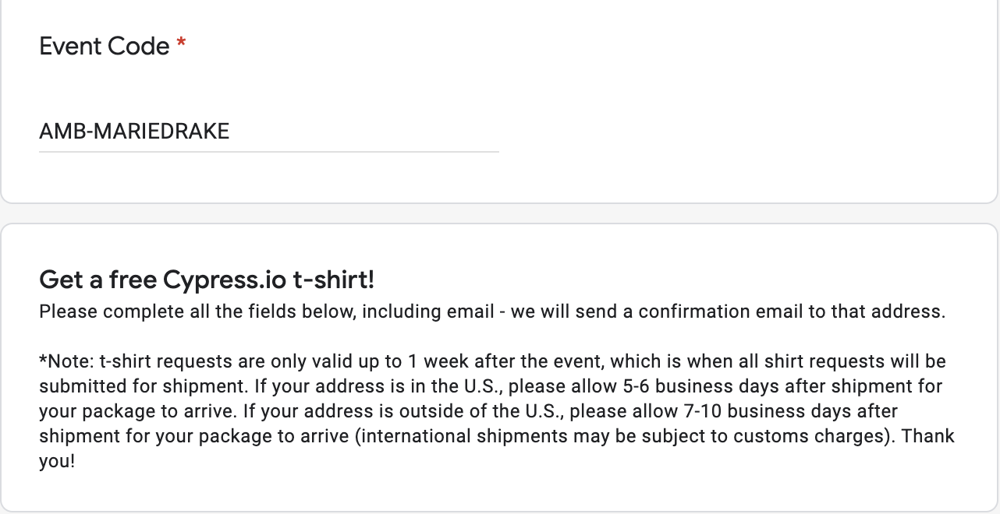

## 🔖 Workshop lessons

- Write E2E tests to mimic user's actions
- Set the initial state before each test
- Always check the documentation
- Anything you can do from DevTools console, you can do from your Cypress tests
- Use code coverage as a GUIDE

+++

## The End 🎉

Thank you for learning E2E testing with [Cypress.io](https://www.cypress.io)

- [https://docs.cypress.io/](https://docs.cypress.io/)
- [https://github.com/cypress-io/cypress](https://github.com/cypress-io/cypress) - don't forget to give it a ✨
- [https://gitter.im/cypress-io/cypress](https://gitter.im/cypress-io/cypress)
- [https://www.cypress.io/support/](https://www.cypress.io/support/)
- [@Cypress_io](https://twitter.com/Cypress_io)

+++

## Instructor Feedback

+++ 

## Get in touch plus other courses

- [Marie's blog](https://www.mariedrake.com/blog)
- [Test automation for Accessibility](https://testautomationu.applitools.com/accessibility-testing-tutorial/)
- [Intro to Cypress](https://www.ministryoftesting.com/dojo/courses/introduction-to-cypress)
- [Marie's twitter](https://twitter.com/mcruzdrake)