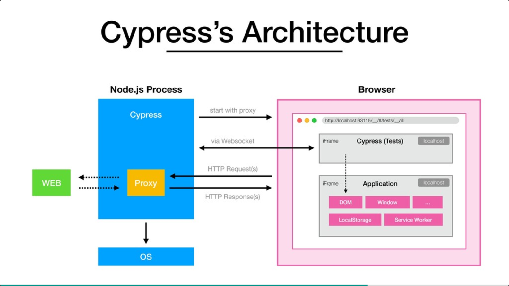

# Cypress Testing Workshop

https://github.com/mdcruz/cypress-testing-workshop

+++

## Marie Drake 👋🏼
- Quality Engineering Manager @ Zoopla
- Previously, Principal Test Automation Engineer @ News UK
- [@mcruzdrake](https://twitter.com/mcruzdrake)
- [mariedrake.com](https://www.mariedrake.com/blog)

+++

## What are we going to learn today? 🤔

+++


+++

## Structure (Day 1)

- Introduction to Cypress
- Overview of Todo app
- Starting a new Cypress project
- Writing some basic tests
- Selector Playground
- Cypress Studio
- Tips on making tests reliable
- Control network calls

+++

## Structure (Day 2)

- Setting up Cypress in CI/CD pipeline
- Cypress Dashboard
- Test Reporters in Cypress
- Cypress Configurations
- Cypress Custom Commands
- Cypress Fixtures
- E2E Code Coverage Report

+++

## Time 🕰

- Day 1 (4-5 hours)
- Day 2 (4-5 hours)
- With breaks of course!

+++

Please: if you have experience with Cypress.io, help others during the workshop 🙏

+++

## How will this workshop works?

1. I'll go over some basic concepts
2. We'll do the exercises together
3. Ask questions!

+++

## Workshop Requirements

You will need:

- `git` to clone this repo
- Node v12+ to install project dependencies

```text
git clone <repo url>
cd cypress-testing-workshop
npm install
```

+++

## Let's get started!

+++

## What is Cypress?

+++



Source: [Dominic Elm](https://twitter.com/elmd_)

+++

## Repo organization

- `/todomvc` is a web application we are going to test
- all tests are in `cypress/integration` folder
  - there are subfolders for exercises
    - `01-basic`
    - `02-adding-items`
    - `03-selector-playground`
    - `04-reset-state`
    - etc
- keep application `todomvc` running!

Note:
We are going to keep the app running, while switching from spec to spec for each part.

+++

## `todomvc`

Let us look at the application.

- `cd todomvc`
- `npm start`
- `open localhost:3001`

**important** keep application running through the entire workshop!

+++

It is a regular TodoMVC application.


+++

## Questions

- what happens when you add a new Todo item?
- how does it get to the server?
- where does the server save it?
- what happens on start up?

Note:
The learners should open DevTools and look at XHR requests that go between the web application and the server. Also the students should find `todomvc/data.json` file with saved items.

+++ 

## Let's start the workshop exercises!

Jump to: [00-start](?p=00-start)

